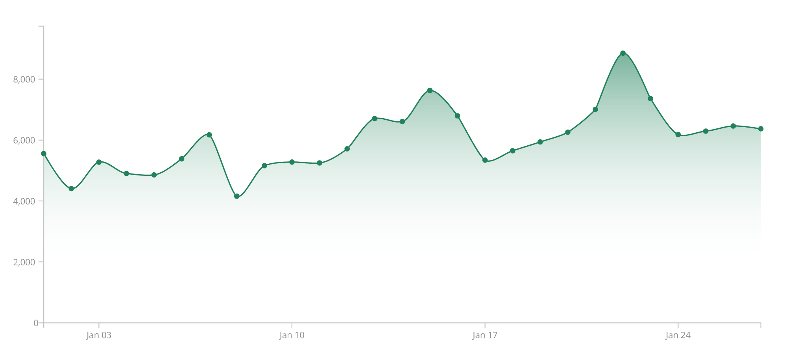
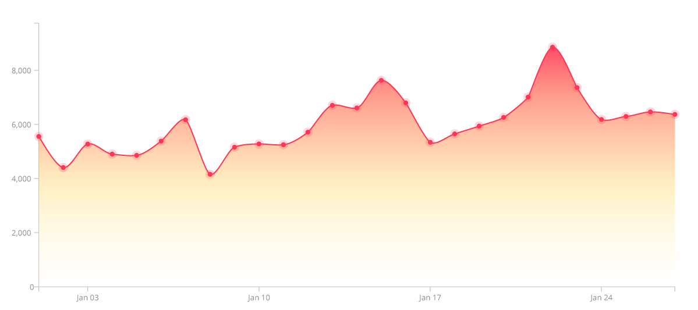
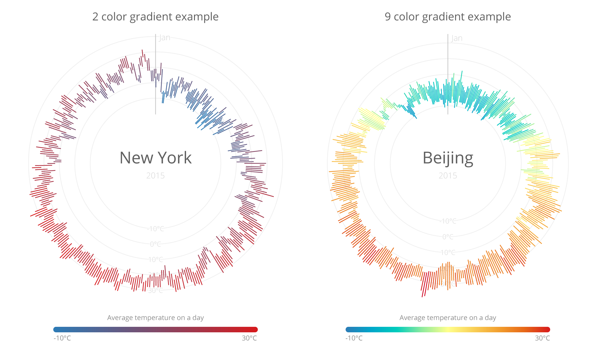
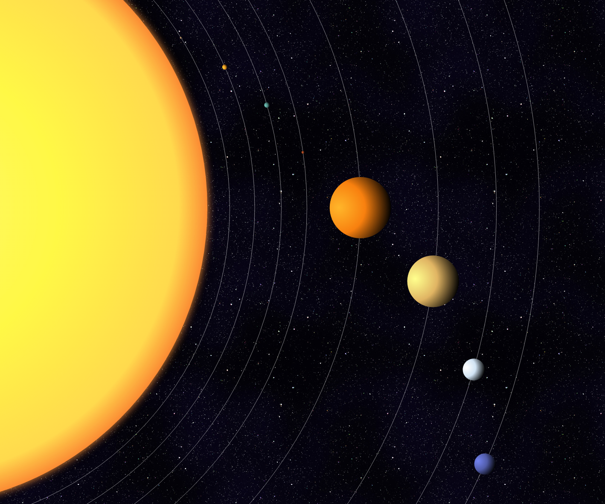
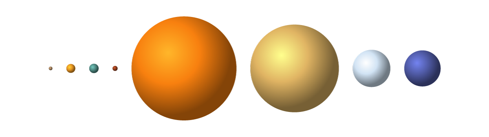

#Boost D3.js Charts with SVG Gradients
##### The GitHub repo containing the code for the NET magazine tutorial

In this repo you can find all of the code that I discuss in my article for NET magazine, and a bit more. You'll find the code that created the images. In some cases I've also added a simpler version that strips it down to the basics of adding an SVG gradient without the extra's I added to create a visually more interesting data visualization. The NET tutorial contained 4 sections and the folders in this repo are ordered in the same way

###Part 1: Linear Gradients
In this folder you can find the first and simplest example, found in the "Linear Gradients" section in which I explain how to add an SVG gradient to a line chart to make it more noticeable.

I've added one extra example that uses more than two colors.

###Part 2: A Smooth Legend
These are the examples from the section "A Smooth Legend" explaining how you can create a simple legend by filling an SVG rectangle with a gradient. In the original example I added two small data visualizations about the min, max and average temperature in New York and Beijing (recreated after the wonderful work of [weather-radials.com](http://www.weather-radials.com)) to serve as the chart that the SVG gradient legend refers to.

But in essence it all came down to the two rectangles, so there is also a code version showing how to create only the two rectangles with D3.

")

### Part 3: Data-Based Gradients
Taken from the section "Data-Based gradients" in which we recreated part of my Exoplanets data visualization [nbremer.github.io/exoplanets](nbremer.github.io/exoplanets), but using our own Solar system planets to see how you can use values from a dataset to create a unique gradient for each data point.

And a stripped down version with only the circles on a row, made to look more like spheres by applying a radial gradient, where the subtleties come from the color per planet as defined in the dataset.

### Part 4: Playing with Orientations
The last section "Playing with the Orientations" expands on the 3rd section, but in this case the orientations of the linear gradients are based on the data as well. Only one version in this folder, the Chord diagram that shows how often the Avengers have collaborated in the MCU movies (up until Thor: Ragnarok).

 are defined by the data")